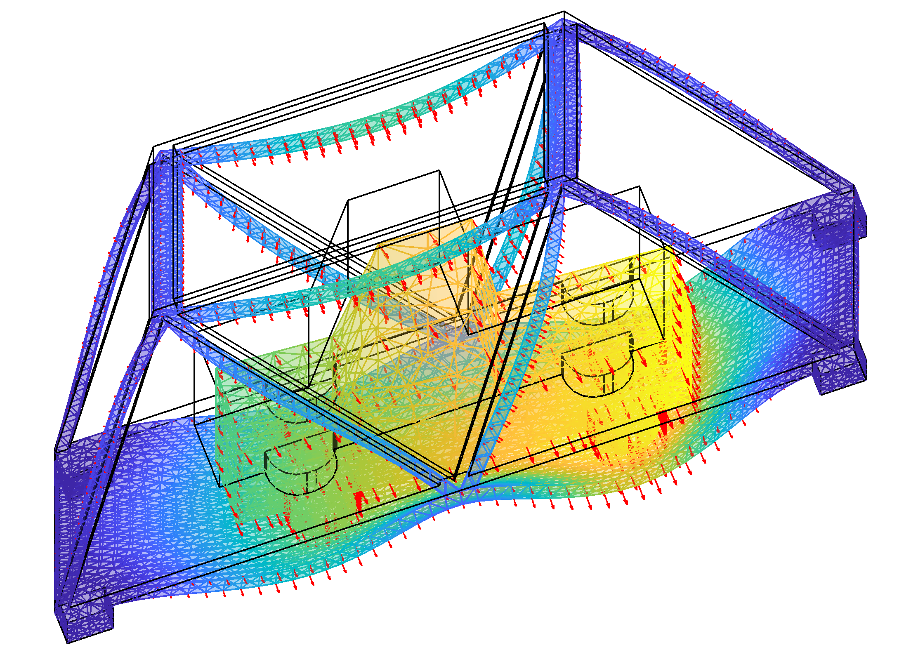
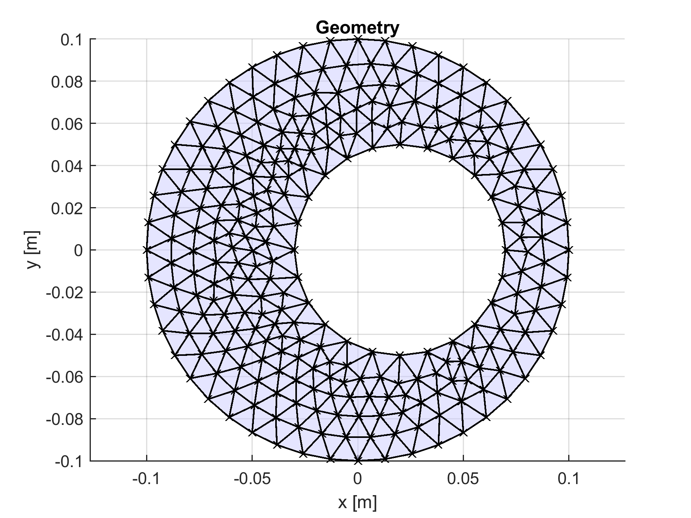
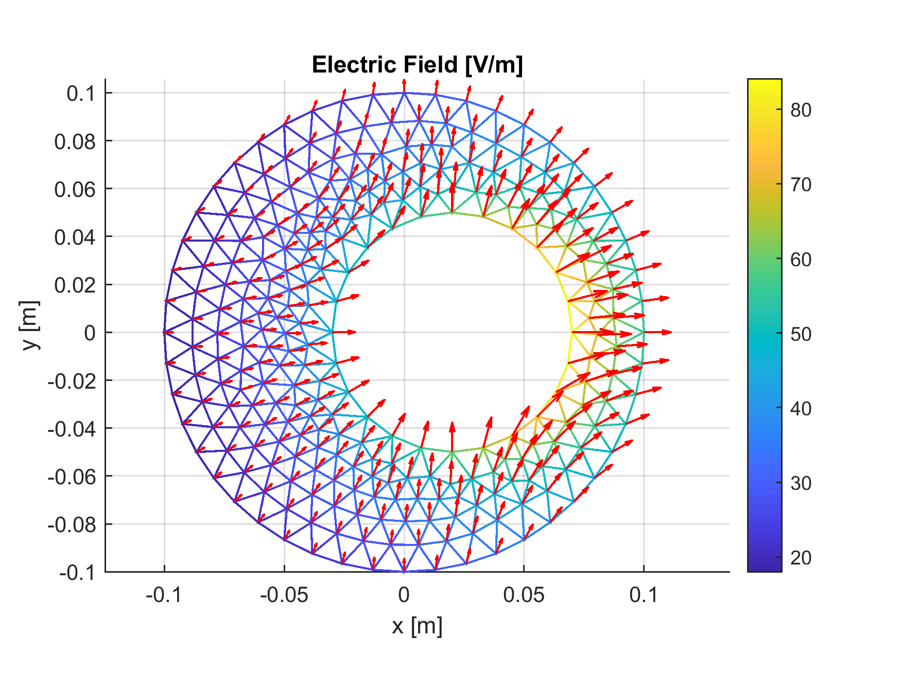
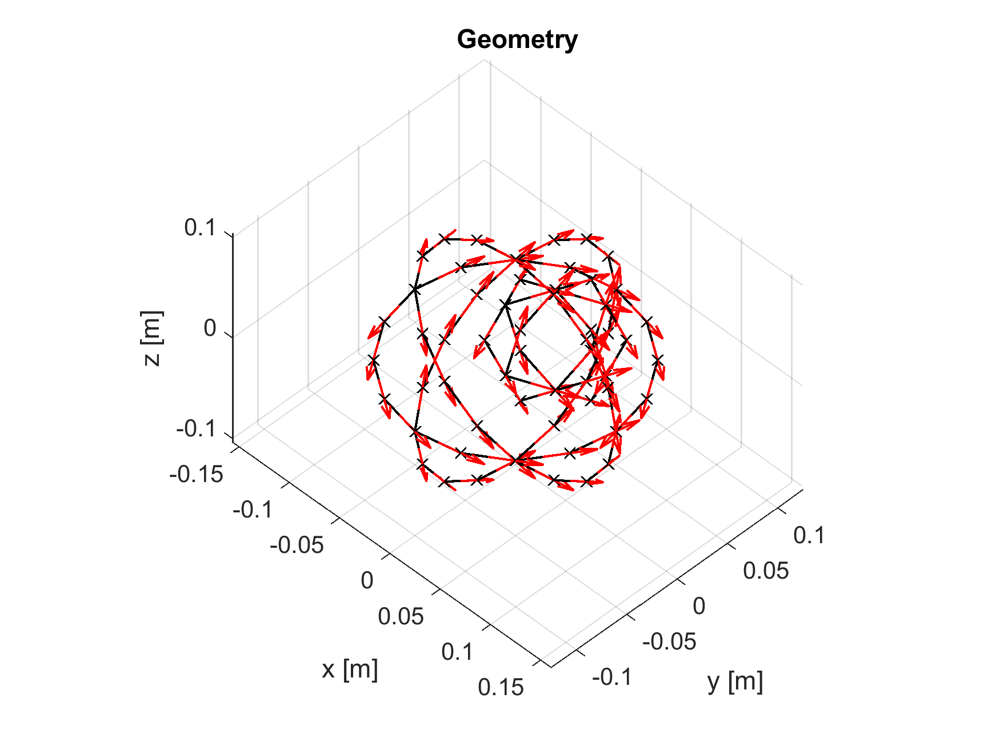
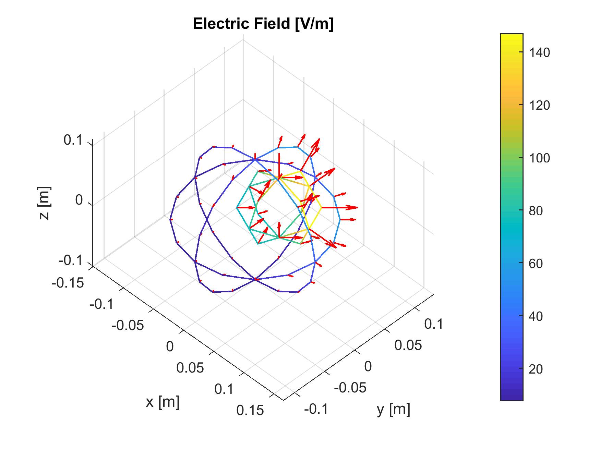
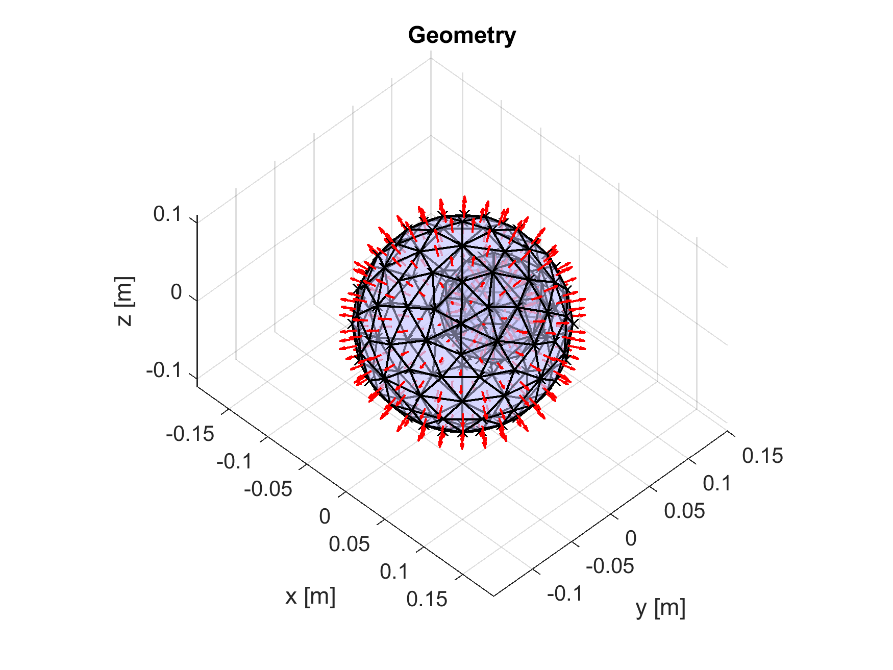
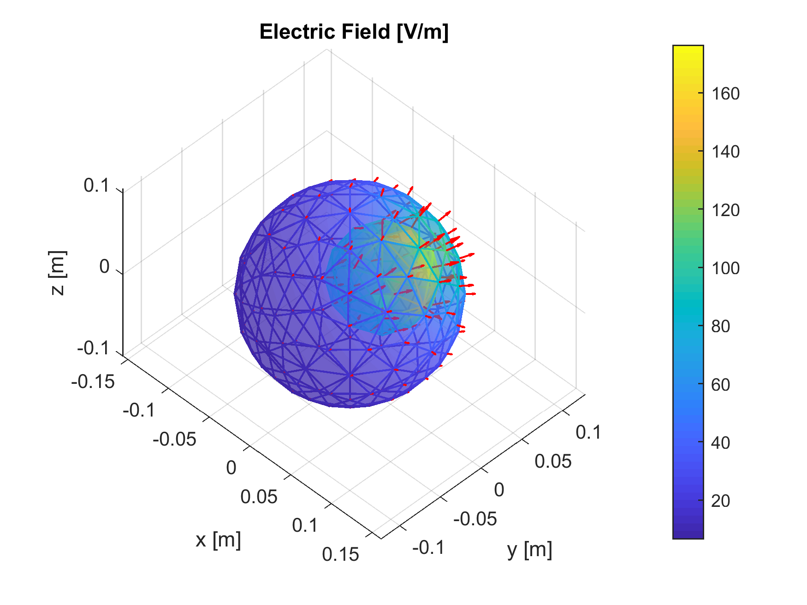

# MATLAB Toolbox for Handling 2D and 3D FEM Meshes

This **MATLAB** toolbox offers numerous functionalities for handling **2d and 3d meshes**:
* **Parse geometry** (edge, surface, and volume) - 'extract_geom.m'
* **Plot geometry** (edge, surface, volume, normal vector, and tangential vector) - 'plot_geom.m'
* **Assign variables** to the vertices of the meshes - 'extract_data.m'
* **Plot variables** (scalar variable and vector field) - 'plot_data.m'
* **Integrate variables** on the meshes (scalar variable and vector field) - 'integrate_data.m'
* **Interpolate variables** on the meshes - 'interp_data.m'

The toolbox can be used for the following tasks:
* Processing **finite element method (FEM)** results (e.g. COMSOL, ANSYS, OpenFOAM)
* Handling **geographic information system (GIS)** data (e.g. digital elevation model)
* Handling **additive manufacturing** data (e.g. 3d printing)

## Examples

The example [run_bridge_example.m](run_bridge_example.m) handles a complex 3d structural analysis:

    

The example [run_simple_example.m](run_simple_example.m) uses a simple 2d and 3d electrostatic simulation.
This example is used to systemically test/demonstrates the different functions of the toolbox:

    
    

    
    

    
    

## Limitations

The following limitations apply to the toolbox:
* For 2d meshes and 3d surfaces, only triangular meshes are supported (no quadrilateral meshes)
* For 3d volumes, only tetrahedral meshes are supported (no hexahedral meshes)
* The integration and interpolation methods are considering linear schemes (no higher-order)
* Probably not scalable to very large meshes (tested with 3.5 million vertices and 7 million triangles)

## Compatibility

The toolbox requires the following software packages:
* Tested with MATLAB R2018b
* No toolboxes are required
* Compatibility with GNU Octave not tested but probably slightly problematic

The following software packages are used for generating the data of the examples:
* COMSOL 5.4 for generating the meshes and the solutions
* Inventor 2019 for the CAD drawings

## Author

**Thomas Guillod** - [GitHub Profile](https://github.com/otvam)

## License

This project is licensed under the **BSD License**, see [LICENSE.md](LICENSE.md).
